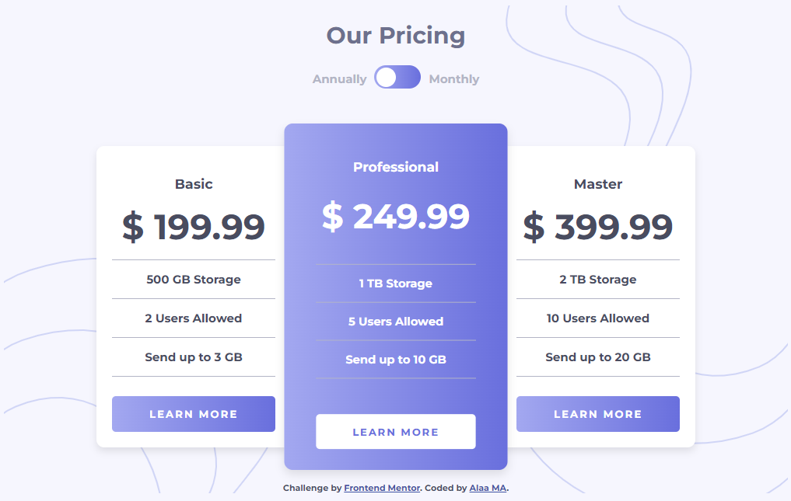

# Pricing component with toggle

Frontend Mentor solution
## Overview

Users should be able to:

- View the optimal layout for the component depending on their device's screen size
- Control the toggle with both their mouse/trackpad and their keyboard
- **Bonus**: Complete the challenge with just HTML and CSS

### Built with

- HTML5 markup
- CSS custom properties, Flexbox
